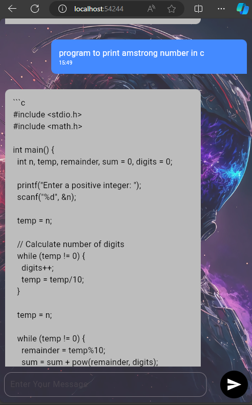

# AI-ChatBot

Download your API Key : https://aistudio.google.com/app/apikey

<b>1. Create or open a Flutter project

2. Add dependencies<br>
Open pubspec.yaml file from your flutter project and under depencencies section add below dependencies

dependencies:<br>
    ```google_generative_ai:```
      <br>
    ```intl:```
    

<i>google generative ai: used to communicate with gemini AI.<br>
intl: used for DataTime Formating.</i>


*Basic Information on how to use google generative ai package (code explanation)*


final model = GenerativeModel(model: 'gemini-pro', apiKey: apiKey);
final content = [Content.text(message)];
final response = await model.generateContent(content);

This above snippet code initializes a GenerativeModel object with the specified model (‘gemini-pro’) and API key. Then, it prepares the content to be sent to the AI model (Basically a Text/prompt message), which consists of a list containing a single text content (message). Finally, it sends this content to the Gemini AI model and awaits the response, which will contain the AI-generated content based on the input message user provide.
<br><br>

<h2>Application sreenshot</h2><br>



