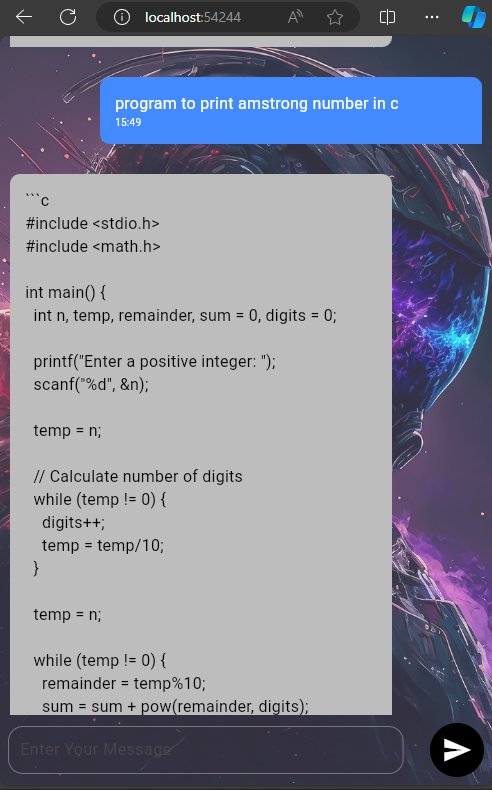

# 🤖 AI-ChatBot

Unlock the power of AI with your very own chatbot! 🌟 

### 📥 Get Your API Key
To get started, download your API Key here: [Get API Key](https://aistudio.google.com/app/apikey)

---

## 🚀 Getting Started

### 1. Create or Open a Flutter Project
Begin your journey by creating a new Flutter project or opening an existing one. 📂

### 2. Add Dependencies
Open the `pubspec.yaml` file in your Flutter project and add the following dependencies under the **dependencies** section:

```yaml
dependencies:
  google_generative_ai: ^latest_version
  intl: ^latest_version
```

### 📚 Dependency Information
- **`google_generative_ai`**: Used to communicate with Gemini AI. 🌐
- **`intl`**: Used for DateTime formatting. 🕒

---

## 💻 Code Snippet

Here’s a basic example of how to use the `google_generative_ai` package:

```dart
final model = GenerativeModel(model: 'gemini-pro', apiKey: apiKey);
final content = [Content.text(message)];
final response = await model.generateContent(content);
```

### 📜 Explanation
- This code initializes a `GenerativeModel` object with the specified model (`'gemini-pro'`) and your API key. 🔑
- It prepares the content to be sent to the AI model, which consists of a list containing a single text message. 💬
- Finally, it sends this content to the Gemini AI model and awaits the response, which will include the AI-generated content based on the input message provided by the user. 🚀

---

## 📸 Application Screenshot

Here’s a sneak peek at the application:



---

### 🎉 Thank you for checking out the AI-ChatBot! 
Get ready to unleash the power of AI in your Flutter apps! 🎊✨
